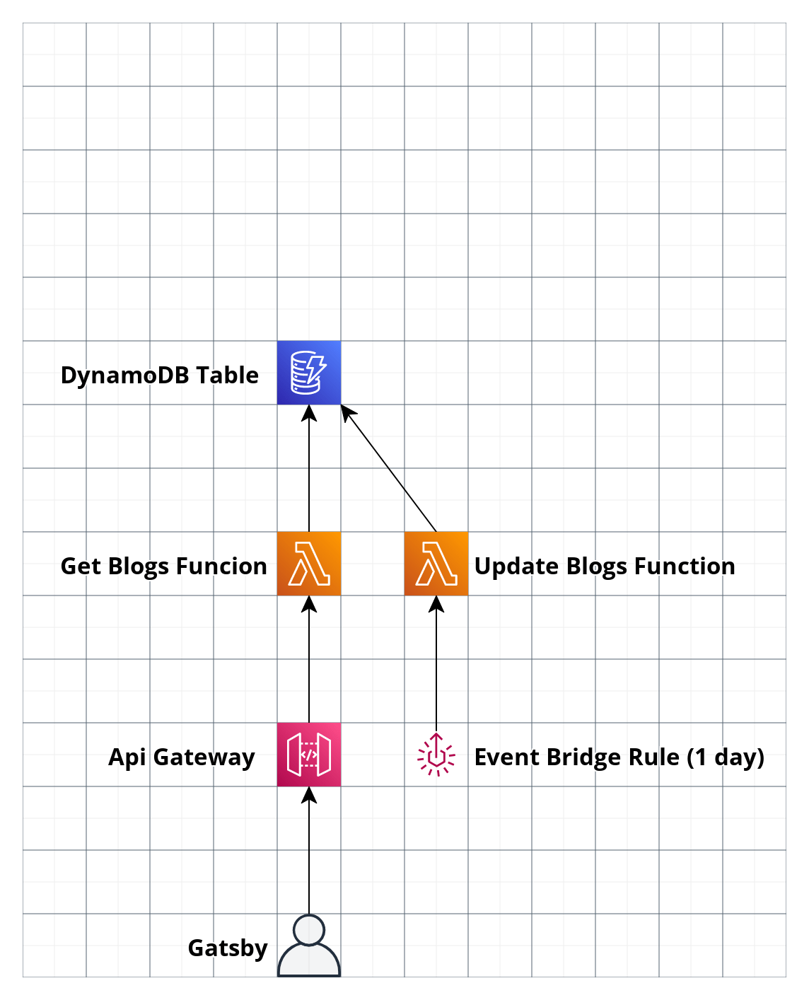

# [andreadiotallevi.com](https://www.andreadiotallevi.com/)

## Blogs

-   [**Why You Should Use The Serverless Application Model (SAM) To Test And Deploy Cloud Resources In AWS**](https://www.andreadiotallevi.com/blog/why-you-should-use-sam-to-test-and-deploy-cloud-resources-in-aws) Four reasons why you should start testing and deploying cloud resources using the Serverless Application Model to help your company become more scalable and productive.
-   [**How To Implement Client Side Redirects In Next.js**](https://www.andreadiotallevi.com/blog/how-to-implement-client-side-redirects-in-next-js) Steps to implement client side redirects in Next.js, using as example whether a user should go to the dashboard (if logged in) or to the homepage (if not logged in).
-   [**12 Lessons I Learned Working As An Architect You Can Also Apply In Software Development**](https://www.andreadiotallevi.com/blog/lessons-learned-working-as-an-architect-you-can-apply-in-software-development) People often use building architecture as a metaphor for describing software, but what are the similarities between building a physical construction and building a web application?
-   [**How To Create A Production Image For A Node.js + TypeScript App Using Docker Multi-Stage Builds**](https://www.andreadiotallevi.com/blog/how-to-create-a-production-image-for-a-node-typescript-app-using-docker-multi-stage-builds) A step by step guide on how to leverage Docker multi-stage builds to create a production image that is small, readable and maintainable.
-   [**5 Benefits Of Typing V Copy Pasting When Working On New Code**](https://www.andreadiotallevi.com/blog/5-benefits-of-typing-v-copy-pasting-when-working-on-new-code) Why you should put the effort in typing out new code and how this will make you a more well-rounded software developer.
-   [**How To Build And Validate A Form With React And TypeScript**](https://www.andreadiotallevi.com/blog/how-to-build-and-validate-a-form-with-react-and-typescript) The state management fundamentals for building and validating a form with React and TypeScript to create the best user experience.
-   [**3 Reasons Why Refactoring Your Code Before Submission Will Make You Stand Out As A Software Developer**](https://www.andreadiotallevi.com/blog/3-reasons-why-refactoring-your-code-before-submission-will-make-you-stand-out-as-a-software-developer) Why you should take the time to thoroughly refactor your code, before opening a pull request, to become a more reliable software developer.
-   [**The 3 Types Of Errors You Need To Handle To Help Your Users Submit A Web Form**](https://www.andreadiotallevi.com/blog/the-3-types-of-errors-you-need-to-handle-to-help-your-users-submit-a-web-form) A summary of the 3 most important types of errors you should validate for when a user submits a form.
-   [**How To Handle Multiple setState Calls On The Same Object In React**](https://www.andreadiotallevi.com/blog/how-to-handle-multiple-set-state-calls-on-the-same-object-in-react) A common pitfall and solution when calling React setState multiple times on the same object.
-   [**How To Format A Well-Formed Response To A GraphQL Request**](https://www.andreadiotallevi.com/blog/how-to-format-a-well-formed-response-to-a-graphql-request) The convention for designing a well-formed GraphQL response in line with the GraphQL specification.
-   [**How To Use The @property Decorator In Python And Django**](https://www.andreadiotallevi.com/blog/how-to-use-the-property-decorator-in-python-and-django) An overview of how the @property decorator works in Python and when to use it in Django.
-   [**Big O Notation And The Magic Of Time Complexity**](https://www.andreadiotallevi.com/blog/big-o-notation-and-the-magic-of-time-complexity) The fundamental components of algorithm complexity analysis, how to derive an algorithm big-O and a list of all the common big-O classes of runtime complexity.
-   [**How To Incrementally Develop An Algorithm Using Test Driven Development**](https://www.andreadiotallevi.com/blog/how-to-incrementally-develop-an-algorithm-using-test-driven-development) The fundamental components of test-driven development, with an example of how to incrementally develop an algorithm using the red-green-refactor cycle.

## Architecture

