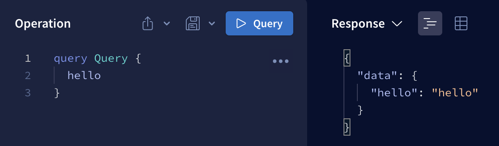

This article is a step by step guide on how to use Docker multi-stage builds to create a production image that is small, readable and maintainable.

As an example, you will build an [Apollo Server](https://www.apollographql.com/docs/apollo-server/) application in Node.js and TypeScript.

## Table of contents

1. Clone the application
2. Test production scripts manually
3. Write the `Dockerfile`
    - Problem 1 - You don't want `devDependencies` in the final image
    - Problem 2 - Multiple `RUN` commands increase the image size
    - Problem 3 - The `Dockerfile` is hard to read and prone to mistakes
4. Run the production image on port `4000`

## 1. Clone the application

Clone [this repository](https://github.com/AndreaDiotallevi/apollo-server-docker) into a folder of your choice:

```shell
git clone git@github.com:AndreaDiotallevi/apollo-server-docker.git
```

Open the folder with your [favourite code editor](https://code.visualstudio.com/):

```shell
code apollo-server-docker
```

These are the scripts and dependencies you'll refer to:

```json
// package.json
{
    ...
    "scripts": {
        "build": "tsc -p .",
        "dev": "ts-node-dev src/index.ts",
        "start": "node dist/index.js"
    },
    ...
    "dependencies": {
        "apollo-server": "^3.10.0",
        "graphql": "^16.5.0"
    },
    "devDependencies": {
        "@types/node": "^18.0.0",
        "ts-node-dev": "^2.0.0",
        "typescript": "^4.8.3"
    }
}
```

And this is the node server `index.ts`, with a placeholder query `hello`:

```ts
import { ApolloServer } from "apollo-server"

const server = new ApolloServer({
    typeDefs: `#graphql
        type Query {
            hello: String
        }
    `,
    resolvers: {
        Query: {
            hello: () => "hello",
        },
    },
})

server.listen().then(({ url }) => {
    console.log(`🚀  Server ready at ${url}`)
})
```

Install all dependencies and test you can start the server locally:

```shell
yarn install && yarn dev
```

If everything works correctly, you should be able to access the server at http://localhost:4000 and query `hello` successfully:



Close the local server with `Ctrl+C`.

## 2. Test production scripts manually

Before moving straight to the `Dockerfile`, test the `build` script locally:

```shell
yarn build
```

This command uses the [TypeScript compiler](https://www.typescriptlang.org/docs/handbook/compiler-options.html) `tsc` to compile TypeScript files into JavaScript files, which is what the browser ultimately reads.

Since there is only a file inside the `src` folder (`index.ts`), you should see only one file inside the `dist` folder (`index.js`).

The configuration options for `tsc` are set in the [tsconfig.json](https://www.typescriptlang.org/tsconfig):

```json
// tsconfig.json
{
    "compilerOptions": {
        "rootDir": "./src" /* Specify the root folder within your source files. */,
        "target": "es5" /* Set the JavaScript language version for emitted JavaScript and include compatible library declarations. */,
        "module": "commonjs" /* Specify what module code is generated. */,
        "types": [
            "node"
        ] /* Specify type package names to be included without being referenced in a source file. */,
        "outDir": "./dist" /* Specify an output folder for all emitted files. */,
        "esModuleInterop": true /* Emit additional JavaScript to ease support for importing CommonJS modules. This enables 'allowSyntheticDefaultImports' for type compatibility. */
    }
}
```

Now that the `dist` folder has been populated, run `index.js` with `node`:

```shell
yarn start
```

Same as before, if everything works correctly, you should be able to query the server successfully at http://localhost:4000.

Close the local server with `Ctrl+C`.

## 3. Write the `Dockerfile`

Start from a base image with [node and alpine](https://hub.docker.com/_/node):

```docker
FROM node:16-alpine
```

Define a working directory to avoid unintended operations in unknown directories:

```docker
WORKDIR /app
```

Copy everything into the container working directory:

```docker
COPY . .
```

To [ignore](https://docs.docker.com/engine/reference/builder/#dockerignore-file) files or folders, list them in the `.dockerignore`:

```ignore
# .dockerignore
dist
node_modules
README.md
```

Install _all_ dependencies and compile the TypeScript files into the `dist` folder:

```docker
RUN yarn install
RUN yarn build
```

Define the command to execute when the container is run:

```docker
CMD [ "yarn", "start" ]
```

Here is the first version of the `Dockerfile` in full:

```docker
# Version 1
FROM node:16-alpine
WORKDIR /app
COPY . .
RUN yarn install
RUN yarn build
CMD [ "yarn", "start" ]
```

### Problem 1 - You don't want `devDependencies` in the final image

Delete the `node_modules` after the build and install only `--production` dependencies:

```docker
# Version 2
FROM node:16-alpine
WORKDIR /app
COPY . .
RUN yarn install
RUN yarn build
RUN rm -rf node_modules
RUN yarn install --production
CMD [ "yarn", "start" ]
```

### Problem 2 - Multiple `RUN` commands increase the image size

Build the image with the tag `version2`:

```shell
docker build -t version2 .
```

Check the image size:

```shell
docker images | grep version2
```

The image size is `321MB`:

```shell
>> version2   latest   bc7c4efc4680   37 seconds ago   321MB
```

Since every `RUN` command creates a new layer, chain consecutive `RUN` statement to [create only one layer](https://docs.docker.com/develop/develop-images/dockerfile_best-practices/#minimize-the-number-of-layers):

```docker
# Version 3
FROM node:16-alpine
WORKDIR /app
COPY . .
RUN yarn install \
&& yarn build \
&& rm -rf node_modules \
&& yarn install --production
CMD [ "yarn", "start" ]
```

This time, build the image with the tag `version3`:

```shell
docker build -t version3 .
```

Check the image size:

```shell
docker images | grep version3
```

The image size is `234MB`:

```shell
version3   latest   004141971cd6   8 seconds ago   234MB
```

You saved `87MB`!

### Problem 3 - The `Dockerfile` is hard to read and prone to mistakes

Docker [multi-stage builds](https://docs.docker.com/build/building/multi-stage/) allow you to create separate stages that have independent size and file system:

```docker
FROM node:16-alpine AS builder
WORKDIR /app
# It needs all dependencies (dev and prod)
# It's in charge of creating the dist folder

FROM node:16-alpine AS final
WORKDIR /app
# It needs only the production dependencies
# It's in charge of creating the final image
```

Since the `builder` stage doesn't create the final image, maximise for readability:

```docker
FROM node:16-alpine AS builder
WORKDIR /app
COPY . .
RUN yarn install
RUN yarn build

FROM node:16-alpine AS final
WORKDIR /app
...
```

In the final image, `COPY` the `dist` folder from the `builder` stage and install only production dependencies:

```docker
# Version 4
FROM node:16-alpine AS builder
WORKDIR /app
COPY . .
RUN yarn install
RUN yarn build

FROM node:16-alpine AS final
WORKDIR /app
COPY --from=builder ./app/dist ./dist
COPY package.json .
COPY yarn.lock .
RUN yarn install --production
CMD [ "yarn", "start" ]
```

This time, build the image with the tag `version4`:

```shell
docker build -t version4 .
```

Check the image size:

```shell
docker images | grep version4
```

The image size is `234MB`:

```shell
version4   latest   d2cc6fcb6fa3   11 seconds ago   234MB
```

You have achieved the same image **size** with a much more **readable** and **maintainable** `Dockerfile`.

## 4. Run the production image on port `4000`

Since the app listens on port `4000`, run the image and [map](https://docs.docker.com/engine/reference/run/#expose-incoming-ports) the container `4000` port to your local machine `4000` port:

```shell
docker run -p 4000:4000 version4
```

You should now be able to query the server at http://localhost:4000.

To view the containers currently running in your local machine:

```shell
docker ps
```

```shell
>> CONTAINER ID   IMAGE       COMMAND                  CREATED          STATUS          PORTS                    NAMES
   5221f7343a0c   version4    "docker-entrypoint.s…"   43 seconds ago   Up 42 seconds   0.0.0.0:4000->4000/tcp   eager_napier
```

To stop the container, use the container id:

```shell
docker stop 5221f7343a0c
```

**Although Docker multi-stage builds is not the only way to create small, readable and maintainable images, it's certainly the most elegant.**

Try it out!

<!-- ## 3. Write the `Dockerfile` with multi-stage builds

Docker multi-stage builds allo

> Docker [multi-stage builds](https://docs.docker.com/build/building/multi-stage/) allow you to use separate stages that can copy files between each other.

The have multiple benefits:

-   **Small**: since every stage starts from a new base image, the final image size is not affected by previous stages
-   **Readable**: you can separate visually the build stage (for building the `dist` folder) from the final stage (for generating the actual image)
-   **Maintainable**: you can write simple code since you don't need to use tricks to make the image size smaller (like chaining `RUN` statements with `&&`)

So, since you want to separate the build stage from the final stage, the `Dockerfile` will have two stages:

-   the `builder` stage, for creating the `dist` folder
-   the `final` stage, for installing only production dependencies, and _copying_ the `dist` folder from the `builder` stage

Start the `builder` stage and name it using the `AS` keyword:

```docker
FROM node:16-alpine AS builder
```

Define a working directory to avoid overwriting the container file system:

```docker
WORKDIR /app
```

Copy everything into the container working directory:

```docker
COPY . .
```

To [ignore](https://docs.docker.com/engine/reference/builder/#dockerignore-file) files or folders, list them in the `.dockerignore`:

```ignore
# .dockerignore
dist
node_modules
README.md
```

Install _all_ dependencies and compile the TypeScript files into the `dist` folder:

```docker
RUN yarn install
RUN yarn build
```

> You don't need to worry about optimising the `builder` phase image since it's not what you will use for creating the final image.

Start the final stage `FROM` a _fresh_ base image:

```docker
FROM node:16-alpine AS final
WORKDIR /app
```

Copy the `dist` folder from the `builder` stage:

```docker
COPY --from=builder ./app/dist ./dist
```

> Delegating the hard work to [previous stages](https://docs.docker.com/develop/develop-images/dockerfile_best-practices/#minimize-the-number-of-layers) of the build makes the image size **smaller**.

> Removing the need of chaining [multiple](https://stackoverflow.com/questions/39223249/multiple-run-vs-single-chained-run-in-dockerfile-which-is-better) `RUN` commands to reduce the size of the image makes the Dockerfile **more readable**.

Copy just the files to install production dependencies:

```docker
COPY package.json .
COPY yarn.lock .
```

Install [only production](https://classic.yarnpkg.com/lang/en/docs/cli/install/#toc-yarn-install-production-true-false) dependencies:

```docker
RUN yarn install --production
```

Define the command to execute when the container is run:

```docker
CMD [ "yarn", "start" ]
```

Here is the `Dockerfile` in full:

```docker
FROM node:16-alpine AS builder
WORKDIR /app
COPY . .
RUN yarn install
RUN yarn build

FROM node:16-alpine AS final
WORKDIR /app
COPY --from=builder ./app/dist ./dist
COPY package.json .
COPY yarn.lock .
RUN yarn install --production
CMD [ "yarn", "start" ]
```

> The visual separation between the two stages makes the Dockerfile **more maintainable**.

To test the `Dockerfile`, build and tag the image, specifying the root folder `.` as the context:

```shell
docker build -t multi-stage .
```

Since the app listens on port `4000`, run the image and [map](https://docs.docker.com/engine/reference/run/#expose-incoming-ports) the container `4000` port to your local machine `4000` port:

```shell
docker run -p 4000:4000 multi-stage
```

You should now be able to query the server at http://localhost:4000.

To view the containers currently running in your local machine:

```shell
docker ps
```

```shell
CONTAINER ID   IMAGE          COMMAND                  CREATED          STATUS          PORTS                    NAMES
5221f7343a0c   multi-stage    "docker-entrypoint.s…"   43 seconds ago   Up 42 seconds   0.0.0.0:4000->4000/tcp   eager_napier
```

To stop the container, type `docker stop` followed by the container id:

```shell
docker stop 5221f7343a0c
```

**Although Docker multi-stage builds isn't the only way to build small, readable and maintainable images, it's certainly the most elegant.**

Try it out. -->
