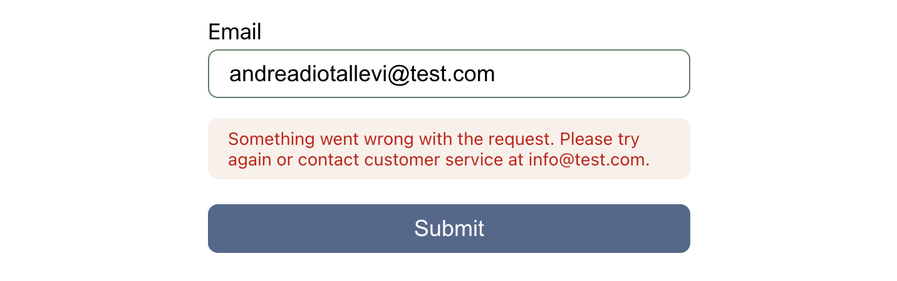

<figcaption>
    
Photo by <a href="https://unsplash.com/photos/T1n_a_ToBEw" target="_blank">J Lee</a>

</figcaption>

It’s hard to recall an online business that never asked me to fill a web form.

In my first 2 years as a software developer I have spent a lot of time building, maintaining and extending form validations. From sign-ins to password resets, **forms are the heart of a web application**. This is why it’s crucial to handle the most important errors graciously to create **the best user experience**.

This article is a summary of the **3 types of errors** you should validate for when a user submits a form.

## 1. Syntax errors

> Syntax errors are the most common types of errors, and **should be caught by the client** as soon as the user completes editing the input fields.

For instance, an email input filled without the `@` character is considered a syntax error. These types of errors are easy to spot and fix, and **don’t have anything to do with the application's internal business logic**. By displaying these errors as soon as the user _leaves_ the field (using the [onBlur](https://www.w3schools.com/jsref/event_onblur.asp) event), you ensure clarity over their progress and increase the chances they will complete the form.

Make users know they are on the right path, as often as possible.

<figure class="error-image">
    
</figure>

## 2. Business logic errors

> Business logic errors **are specific to your application domain** and should be caught by the server.

Can a user buy more than £5000 worth of vouchers? Is this email available? Any validation that _needs_ some backend logic or a database query should be done in the server, to avoid code duplication in the different clients (mobile app, web app, etc.).

Locate business logic validation in one place to better integrate new clients in the future.

<figure class="error-image">
    
</figure>

## 3. Network errors

> Network errors are errors that **cause the request to fail**.

The problem can be a loss of internet connection, a server timing out because of high traffic or simply a service that is temporarily unavailable. They don’t depend on the user input and application business logic and can’t be predicted. So, it’s important to place safety measures to make sure they are handled graciously and communicated clearly to the user.

Use a [try-catch](https://developer.mozilla.org/en-US/docs/Web/JavaScript/Reference/Statements/try...catch) block to handle unexpected behaviours and give confidence to the user it was just a temporary problem by displaying a descriptive error message.

<figure class="error-image">
    
</figure>

**No matter how tech-savvy or not, your users _are_ going to make mistakes while filling an online form.**

The real question is, are they going to be able to correct them?
